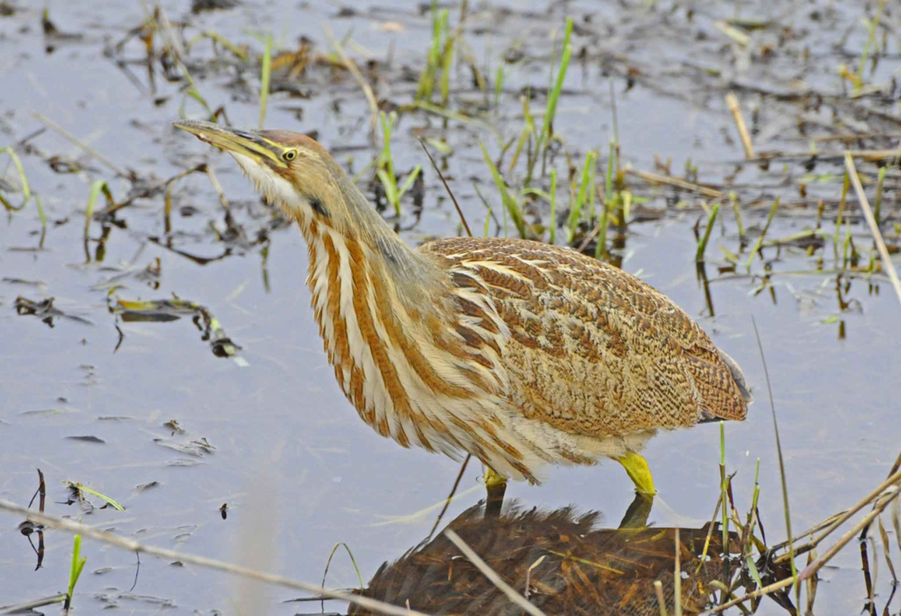
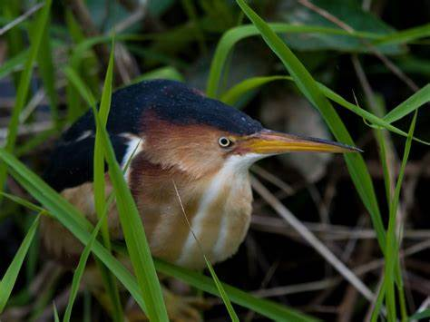

```{r packages, echo=FALSE}
packages<-c("cowplot","dismo","leaflet","mapdata","OpenStreetMap","rasterVis","rdryad","rgbif","sf","tidyverse")
sapply(packages, library, character.only=T)
library(raster)
```


```{r dismo,echo=FALSE}
pilo.dismo <- gbif("botaurus", species = "lentiginosus", ext = c(-100,-85,32,42),
                   geo = TRUE, download = TRUE, removeZeros = TRUE)

```


gbif plot of American Bittern records in the Midwest


```{r ggmap American Bittern, echo=FALSE}

us <- map_data("state")

ggplot() +
  geom_polygon(data = us, aes(x=long, y = lat, group = group),
               fill = "white", color="black") +
  geom_point(data = pilo.dismo, aes(x=lon, y=lat)) + 
  xlab("Longitude") + ylab("Latitude") +
  coord_fixed(xlim = c(-95,-85), ylim = c(35,43)) +
  xlab("Longitude") + ylab("Latitude") + ggtitle("American Bittern in the Midwest US") + 
  theme_bw() + theme(plot.title = element_text(hjust = 0.5)) + 
  theme(panel.grid.major = element_blank(), 
        panel.grid.minor = element_blank(),
        panel.background = element_rect(fill = "lightblue"))
```

```{r rgbif, echo=FALSE}
AB.rgbif <- occ_data(scientificName = "Botaurus lentiginosus",
                       hasCoordinate = TRUE, limit = 2000,
                       decimalLongitude = "-95, -80", 
                       decimalLatitude = "35, 42")

LB.rgbif <- occ_data(scientificName = "Ixobrychus exilis",
                       hasCoordinate = TRUE, limit = 2000,
                       decimalLongitude = "-95, -80", 
                       decimalLatitude = "35, 42")

```


```{r rgbif cleanup, echo=FALSE}
AB.rgbif.df <- cbind.data.frame(AB.rgbif$data$species,
                                  AB.rgbif$data$decimalLatitude,
                                  AB.rgbif$data$decimalLongitude,
                                  AB.rgbif$data$stateProvince,
                                  AB.rgbif$data$verbatimLocality)

LB.rgbif.df <- cbind.data.frame(LB.rgbif$data$species,
                                  LB.rgbif$data$decimalLatitude,
                                  LB.rgbif$data$decimalLongitude,
                                  LB.rgbif$data$stateProvince,
                                  LB.rgbif$data$verbatimLocality)

colnames(AB.rgbif.df) <- c("species","y","x","state","location")
colnames(LB.rgbif.df) <- c("species","y","x","state","location")

```


rgbif plots of Least and American Bittern in the Midwest


```{r rgbif ggplot, echo=FALSE}
bittern <- ggplot() +
  geom_polygon(data = us, aes(x=long, y = lat, group = group),
               fill = "white", color="black") +
  geom_point(data = AB.rgbif.df, aes(x=x, y=y, color = species), size = 3) +
  geom_point(data = LB.rgbif.df, aes(x=x, y=y, color = species), size = 3) +  
  coord_fixed(xlim = c(-95,-80), ylim = c(35,42)) +
  xlab("Longitude") + ylab("Latitude") + ggtitle("American and Least Bittern in the Midwest") + 
  guides(color=guide_legend("Legend", override.aes = list(size = 4))) +
  theme_bw() + theme(plot.title = element_text(hjust = 0.5)) + 
  theme(legend.position = "bottom") +
  theme(legend.title.align = 0.5, legend.box.just = "center") +
  theme(panel.grid.major = element_blank(), 
        panel.grid.minor = element_blank(),
        panel.background = element_rect(fill = "lightblue"))
bittern
```


```{r leaflet, echo=FALSE}

leaflet(AB.rgbif.df) %>% 
  addTiles() %>% 
  addCircleMarkers(AB.rgbif.df$x,
                   AB.rgbif.df$y,
                   popup = AB.rgbif.df$species,
                   radius = 3,
                   weight = 2,
                   color = "green",
                   fillColor = "green",
                   fillOpacity = 0.5) %>%
  addMiniMap(position = 'topright',
             width = 100, 
             height = 100,
             toggleDisplay = FALSE) %>%
  addScaleBar(position = "bottomright")

```


```{r bio, echo=FALSE}
bioclim <- getData(name = "worldclim", res = 2.5, var = "bio", path = "./")

names(bioclim) <- c("Ann Mean Temp","Mean Diurnal Range","Isothermality","Temperature Seasonality",
                    "Max Temp Warmest Mo","Min Temp Coldest Mo","Ann Temp Range","Mean Temp Wettest Qtr",
                    "Mean Temp Driest Qtr","Mean Temp Warmest Qtr","Mean Temp Coldest Qtr","Annual
                    Precip","Precip Wettest Mo","Precip Driest Mo","Precip Seasonality","Precip Wettest
                    Qtr","Precip Driest Qtr","Precip Warmest Qtr","Precip Coldest Qtr")

bio.extent <- extent(x = c(
  min(AB.rgbif.df$x),
  max(AB.rgbif.df$x),
  min(LB.rgbif.df$y),
  max(LB.rgbif.df$y)))

bioclim.extent <- crop(x = bioclim, y = bio.extent)

bioclim.model <- bioclim(x = bioclim.extent, p = cbind(AB.rgbif.df$x,AB.rgbif.df$y))
presence.model <- dismo::predict(object = bioclim.model, 
                                 x = bioclim.extent, 
                                 ext = bio.extent)


```


Map of American Bittern probability based of climatic data


```{r bio gg, echo=FALSE}

rasterVis::gplot(presence.model) + 
  geom_polygon(data = us, aes(x= long, y = lat, group = group),
               fill = "gray", color="black") +
  geom_raster(aes(fill=value)) +
  geom_polygon(data = us, aes(x= long, y = lat, group = group),
               fill = NA, color="black") +
  geom_point(data = AB.rgbif.df, aes(x = x, y = y), size = 2, color = "black", alpha = 0.5) +
  scale_fill_gradientn(colours=c("blue","lightblue","green"), "Probability") +
  coord_fixed(xlim = c(-95,-80), ylim = c(36,42)) +
  xlab("Longitude") + ylab("Latitude") + ggtitle("Probability of AB Occurrence") + 
  theme_bw() + theme(plot.title = element_text(hjust = 0.5)) + theme(legend.position = "right") +
  theme(panel.grid.major = element_blank(), 
        panel.grid.minor = element_blank(),
        panel.background = element_rect(fill = "lightblue"))

```


